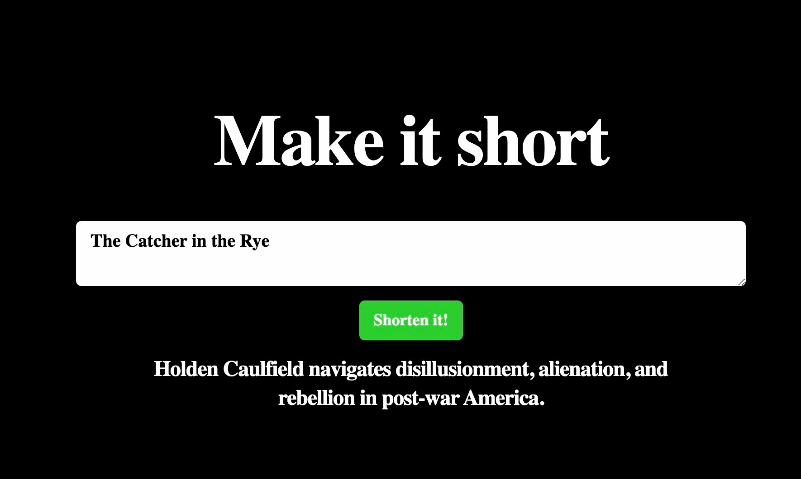

# Make it short

I came across Ollama(https://ollama.ai/) and developed a web app. It took me:
- 5 minutes to configure #LLama 2 with a prompt
- 5 minutes for the backend call
- 2 hours to make the page appealing for a LinkedIn post

In the context of the evolution of Artificial Intelligence, it is important to note that on the one hand, small research teams strive to keep up with giants like #OpenAI in the development of advanced Artificial Intelligence models. On the other hand, there is a thriving ecosystem of tools that deal with all aspects of AI.

Ollama is one of those tools and offers the possibility to experiment with models such as LLama, Mistral, Vicuna, etc., completely locally, providing a convenient API for applications. It is inspired by Docker concepts and is extremely simple to use. Products of this type bring developers closer to the world of machine learning, making the integration of a model as simple as using a third-party API.

## How do I use this?

Run the following commands to get started:

```bash
yarn install
yarn dev
```

Download Ollama and run it locally. Then create a model and use the model file to create a summary model.

```bash
ollama create summary_model -f ./Modelfile
```

Open [http://localhost:3000](http://localhost:3000) with your browser to see the result.




## Create T3 App

This is a [T3 Stack](https://create.t3.gg/) project bootstrapped with `create-t3-app`.

## What's next? How do I make an app with this?

We try to keep this project as simple as possible, so you can start with just the scaffolding we set up for you, and add additional things later when they become necessary.

If you are not familiar with the different technologies used in this project, please refer to the respective docs. If you still are in the wind, please join our [Discord](https://t3.gg/discord) and ask for help.

- [Next.js](https://nextjs.org)
- [NextAuth.js](https://next-auth.js.org)
- [Prisma](https://prisma.io)
- [Tailwind CSS](https://tailwindcss.com)
- [tRPC](https://trpc.io)

## Learn More

To learn more about the [T3 Stack](https://create.t3.gg/), take a look at the following resources:

- [Documentation](https://create.t3.gg/)
- [Learn the T3 Stack](https://create.t3.gg/en/faq#what-learning-resources-are-currently-available) — Check out these awesome tutorials

You can check out the [create-t3-app GitHub repository](https://github.com/t3-oss/create-t3-app) — your feedback and contributions are welcome!

## How do I deploy this?

Follow our deployment guides for [Vercel](https://create.t3.gg/en/deployment/vercel), [Netlify](https://create.t3.gg/en/deployment/netlify) and [Docker](https://create.t3.gg/en/deployment/docker) for more information.
